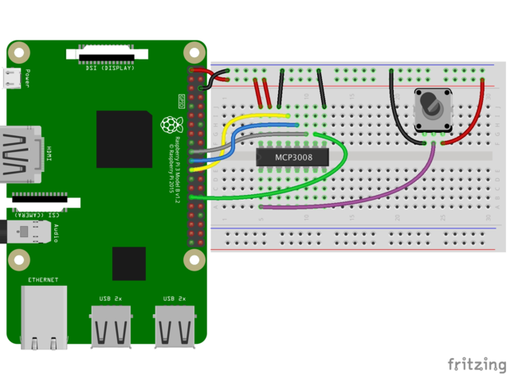

# Analogic-to-Digital Converter

The ADC MCP-3008 will be used in this project. The [CircuitPython library for the 
MCP3xxx series](https://github.com/tukno/Adafruit_CircuitPython_MCP3xxx) of analog-to-digital converters made by Adafruit will be used to interface
to the ADC output. Adafruit has a [nice tutorial](https://learn.adafruit.com/mcp3008-spi-adc/python-circuitpython) showing the usage of the ADC.

## Dependencies

This driver depends on:

* [Adafruit CircuitPython](https://github.com/adafruit/circuitpython)
* [Bus Device](https://github.com/adafruit/Adafruit_CircuitPython_BusDevice)

Please ensure all dependencies are available on the CircuitPython filesystem.
This is easily achieved by downloading [the Adafruit library and driver bundle](https://github.com/adafruit/Adafruit_CircuitPython_Bundle).


## Installing

### Installing dependencies: CircuitPython Libraries on Raspberry Pi

Using the [tutorial](https://learn.adafruit.com/circuitpython-on-raspberrypi-linux/installing-circuitpython-on-raspberry-pi) as reference.

**Make sure to be using Python 3 and pip3 when running the commands!!!**

1 - Update Your Pi and Python

```bash
  sudo apt-get update
  sudo apt-get upgrade
```

and

```bash
  sudo pip3 install --upgrade setuptools
```

If above doesn't work try:

```bash
sudo apt-get install python3-pip
```

2 - Enable I2C and SPI

A vast number of our CircuitPython drivers use I2C and SPI for interfacing so you'll want to get those enabled.

You only have to do this once per Raspberry Pi but by default both interfaces are disabled!

- [Enable I2C](https://learn.adafruit.com/adafruits-raspberry-pi-lesson-4-gpio-setup/configuring-i2c)
- [Enable SPI](https://learn.adafruit.com/adafruits-raspberry-pi-lesson-4-gpio-setup/configuring-spi)

Once you're done with both and have rebooted, verify you have the I2C and SPI devices with the command:

```bash
ls /dev/i2c* /dev/spi*
```

You should see the response

```bash
/dev/i2c-1 /dev/spidev0.0 /dev/spidev0.1
```

(OPTIONAL) Enabling Second SPI

If you are using the main SPI port for a display or something and need another hardware SPI port, you can enable it by adding the line

```bash
dtoverlay=spi1-3cs
```

to the bottom of /boot/config.txt and rebooting. You'll then see the addition of some /dev/spidev1.x devices

3 - Install Python libraries

Now you're ready to install all the python support

Run the following command to install the Raspberry PI GPIO library:

```bash
pip3 install RPI.GPIO
```

Run the following command to install adafruit_blinka

```bash
pip3 install adafruit-blinka
```

The computer will install a few different libraries such as adafruit-pureio (our ioctl-only i2c library), spidev (for SPI interfacing), Adafruit-GPIO (for detecting your board) and of course adafruit-blinka.

That's pretty much it! You're now ready!

## Installing from PiPy

To install the MCP driver in a virtual environment in your current project:

  ```bash
    mkdir project-name && cd project-name
    python3 -m venv .env
    source .env/bin/activate
    pip3 install adafruit-circuitpython-mcp3xxx
  ```

## Wiring
Connection using a standard SPI connection to the Raspberry Pi:
- MCP3008 CLK to Pi SCLK
- MCP3008 DOUT to Pi MISO
- MCP3008 DIN to Pi MOSI
- MCP3008 CS to Pi D5
- MCP3008 VDD to Pi 3.3V
- MCP3008 VREF to Pi 3.3V
- MCP3008 AGND to Pi GND
- MCP3008 DGND to Pi GND
- MCP3008 CH0 to Potentiometer middle pin

Check the image extracted from Adafruit:




