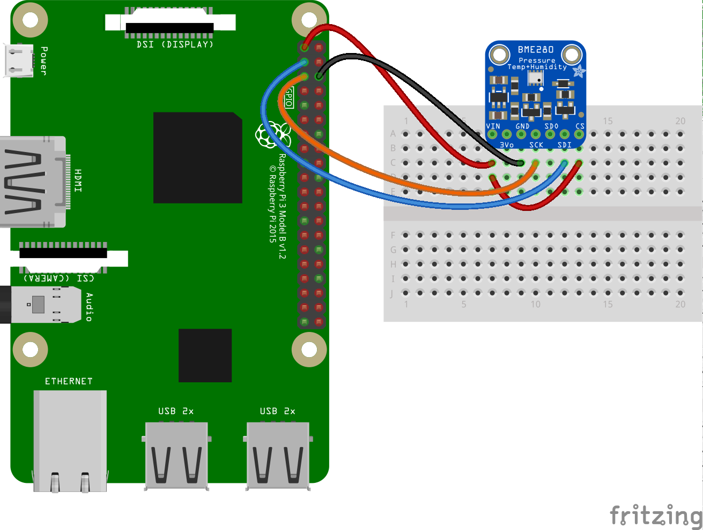

# BME280: Sensor to measure Barometric pressure and temperature

The BME280 is the next-generation of sensors from Bosch, and is the upgrade to the BMP085/BMP180/BMP183 - with a low altitude noise of 0.25m and the same fast conversion time. It has the same specifications, but can use either I2C or SPI. This precision sensor from Bosch is the best low-cost sensing solution for measuring humidity with ±3% accuracy, barometric pressure with ±1 hPa absolute accuraccy, and temperature with ±1.0°C accuracy. Because pressure changes with altitude, and the pressure measurements are so good, you can also use it as an altimeter with ±1 meter accuracy!
In this tutorial will be used I2C to connect the sensor to the Raspberry Pi board.

## I2C Wiring

Here's the Raspberry Pi wired with I2C for BME280 sensors that have the default i2c address as 0x76:

- Pi 3V3 to sensor VIN
- Pi 3V3 to sensor CS (some sensor fabricants use the same pin for VIN and CS)
- Pi GND to sensor GND
- Pi SCL to sensor SCL (SCK)
- Pi SDA to sensor SDA (SDI)

Check the image extracted from Adafruit:



## BME280 library dependencies

This driver depends on:

- [Adafruit CircuitPython](https://github.com/adafruit/circuitpython)
- [Bus Device](https://github.com/adafruit/Adafruit_CircuitPython_BusDevice)

Please ensure all dependencies are available on the CircuitPython filesystem.
This is easily achieved by downloading [the Adafruit library and driver bundle](https://github.com/adafruit/Adafruit_CircuitPython_Bundle).

## Installing BME280 library using pip

Use pip to install the library from PyPI. Load the virtual enviroment and run the following command on the terminal:

```bash
sudo pip3 install adafruit-circuitpython-bme280
```

## Usage for non default address sensors

By default the libary sets `0x77` i2c address for the device, but some sensor models use the address `0x76`, in this case it is necessary to pass it as parameter in bme280 constructor method:

```python
import board
import digitalio
import busio
import time
import adafruit_bme280

# Create library object using our Bus I2C port
i2c = busio.I2C(board.SCL, board.SDA)
bme280 = adafruit_bme280.Adafruit_BME280_I2C(i2c)
#or with other sensor address
#bme280 = adafruit_bme280.Adafruit_BME280_I2C(i2c, address=0x76)

# change this to match the location's pressure (hPa) at sea level
bme280.sea_level_pressure = 1013.25

while True:
    print("\nTemperature: %0.1f C" % bme280.temperature)
    print("Humidity: %0.1f %%" % bme280.humidity)
    print("Pressure: %0.1f hPa" % bme280.pressure)
    print("Altitude = %0.2f meters" % bme280.altitude)
    time.sleep(2)
```

---

### References

- [Adafruit BME280 Library](https://circuitpython.readthedocs.io/projects/bme280/en/latest/)
