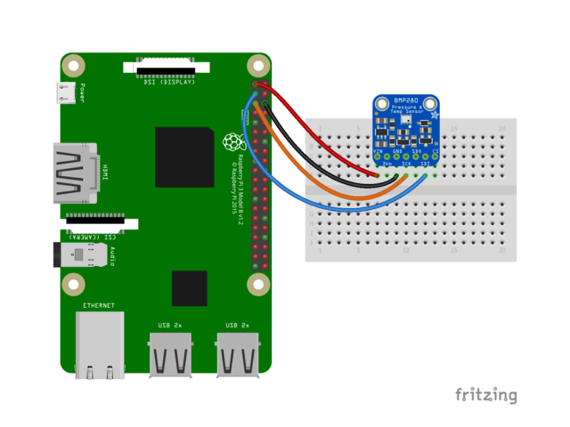

# BMP280: Sensor to measure Barometric pressure and temperature

The BMP280 sensor is an environmental sensor with temperature and barometric pressure that is the next generation upgrade to the BMP085/BMP180/BMP183. This sensor is great for all sorts of weather sensing and can even be used in both I2C and SPI!
This precision sensor from Bosch is the best low-cost, precision sensing solution for measuring barometric pressure with ±1 hPa absolute accuraccy, and temperature with ±1.0°C accuracy. Because pressure changes with altitude, and the pressure measurements are so good, you can also use it as an altimeter with ±1 meter accuracy.
In this tutorial will be used I2C to connect the sensor to the Raspberry Pi board.

## I2C Wiring

Here's the Raspberry Pi wired with I2C for BMP280 sensors that have the default i2c address as 0x77:

- Pi 3V3 to sensor VIN
- Pi GND to sensor GND
- Pi SCL to sensor SCK
- Pi SDA to sensor SDI

For generic sensors that are not the original Adafruit BMP280, the i2c address might come as 0x76, in this case it is necessary to connect the sensor SDO pin to 3V3 to switch the i2c address to 0x77.

- Pi 3v3 to sensor SDO (The sensor used in the project needs this extra step)

(Another option is to change the default library i2c address from 0x77 to 0x76, in this case it is not necessary to connect the SDO pin to Pi 3V3)

Check the image extracted from Adafruit:



## BMP280 library dependencies

This driver depends on:

- [Adafruit CircuitPython](https://github.com/adafruit/circuitpython)
- [Bus Device](https://github.com/adafruit/Adafruit_CircuitPython_BusDevice)

Please ensure all dependencies are available on the CircuitPython filesystem.
This is easily achieved by downloading [the Adafruit library and driver bundle](https://github.com/adafruit/Adafruit_CircuitPython_Bundle).

## Installing BMP280 library using pip

Use pip to install the library from PyPI. Load the virtual enviroment and run the following command on the terminal:

```bash
pip3 install adafruit-circuitpython-bmp280
```
