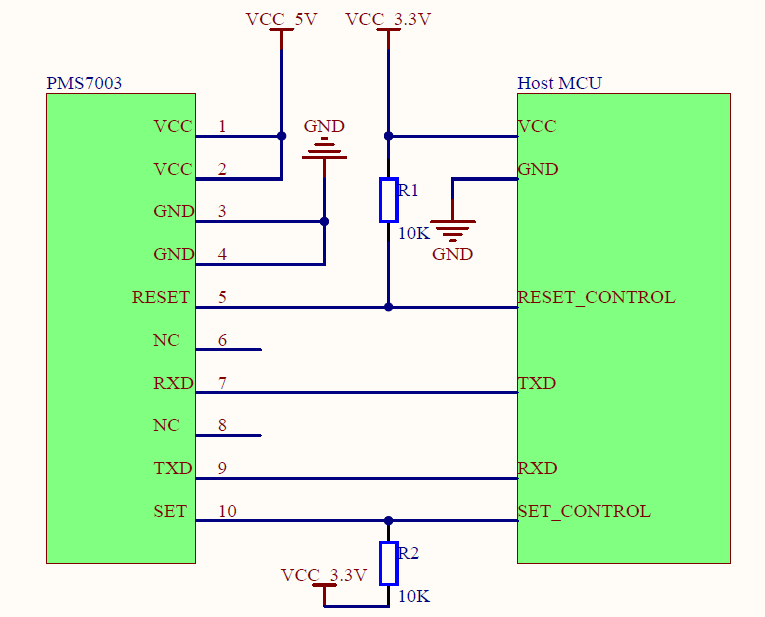

# PMS7003: Sensor to measure particulate matter

The PMS7003 sensor is an particulate matter sensor based on Laser Light Scattering Technique. The PMS7003 sensor is a kind of digital and universal particle concentration sensor, which can be used to obtain the number of suspended particles in the air, i.e. the concentration of particles, and output them in the form of digital interface via UART. 

Features
- Range of measurment
  - 0.3 ~ 1.0 µm;
  - 1.0 ~ 2.5µm;
  - 2.5 ~ 10µm
- Data output via UART
- Effective Range: 0 ~ 500 µg/m3
- Power Supply: 5 V
- Interface Level: 3,3 V
- Active Current: ≤100 mA
- Standby Current: ≤200 µA
- Working Temperature Range: -10 ~ +60°C
- Working Humidity Range: 0 ~ 99%
- MTTF: ≥3 years
- Size: 48 x 37 x 12 mm

## Enable Serial UART communication interface

1 - Enable Serial UART Interface
  To allow Raspberry Pi serial communication using the UART protocol is necessary to configure GPIO 14 as transmitter (TX) and GPIO 15 as receiver (RX). 
  The SoCs used on the Raspberry Pis have two built-in UARTs, a PL011 and a mini UART. By default, on Raspberry Pis equipped with the wireless/Bluetooth module (Raspberry Pi 3 and Raspberry Pi Zero W) The SoCs used on the Raspberry Pis have two built-in UARTs, [a PL011 and a mini UART](https://www.raspberrypi.org/documentation/configuration/uart.md). 
  In Linux device terms, by default, /dev/ttyS0 refers to the mini UART, and /dev/ttyAMA0 refers to the PL011. The primary UART is the one assigned to the Linux console, which depends on the Raspberry Pi model as described above. There are also symlinks: /dev/serial0, which always refers to the primary UART (if enabled), and /dev/serial1, which similarly always refers to the secondary UART (if enabled).
  
  The mini-UART will be used to communicate with the PMS7003. Since by default, the serial port is assigned to the Linux console. It is necessary to change this setting to able to communicate with the sensor. In the terminal run the command: 

  ```bash
  sudo raspi-config
  ```

  In Interfacing Options > Serial section, disable the serial login shell and enable the serial interface. Reboot the Raspberry Pi for the change to take effect:


  ```bash
  sudo reboot 0
  ```

  The symlink `"/dev/serial0"` location always refers to the primary UART (mini UART), and it represents the PMS7003 device file. It will be used to communicate with the sensor (`"/dev/ttyS0"` can also be used.).

## Installing PMS7003 library using pip

An open-source minimalistic python interface for PMS7003 sensor developed by [Tomasz Lewicki](https://github.com/tomek-l/pms7003) will be used to interface with the sensor. 

The code reads PM values from serial port. Tested on Raspberry Pi, but it should work on any machine with Python and serial port.

Use pip to install the library from PyPI. Load the virtual enviroment and run the following command on the terminal:

```bash
pip3 install pms7003
```

# Wiring

Here's the Raspberry Pi wired via UART to the PMS7003 sensor:

- Pi 5V to PMS7003 VCC (pins 1 and 2)
- Pi TX (GPIO 14) to PMS7003 RX (pin 7)
- Pi RX (GPIO 15) to PMS7003 TX (pin 9)
- Pi GND to PMS7003 GND (pins 3 and 4)

The sensor data pins outputs a 0 - 3V3 signal, so it is not necessary a level shifting to interface with the Raspberry Pi.  
The other pins are not used. According to the PMS7003 datasheet the other pins must be left disconnected if not used.

